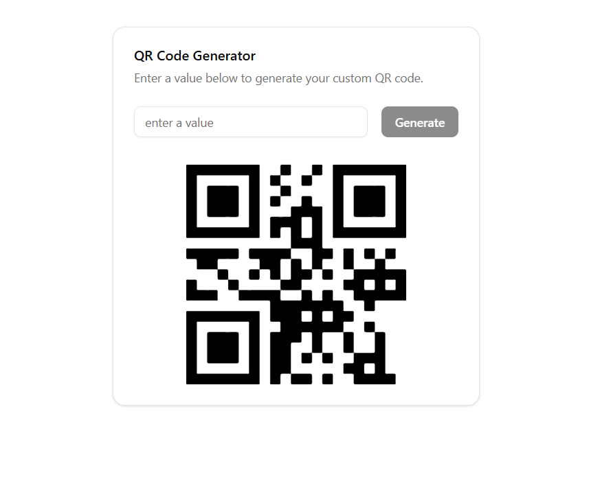

# 📱 QR Code Generator

A professional, high-quality QR code generator component built with **React 19**, **TypeScript**, and **Tailwind CSS**. Designed with a focus on clean aesthetics and seamless user experience, utilizing **Shadcn UI** components.



## 🚀 Live Demo

Check out the live demo here: [Live Demo](https://react-qr-code-generator.pages.dev/)

## ✨ Features

- ⚡ **Real-time Generation**: Instant QR code updates based on user input.
- 🎨 **Premium UI/UX**: Built with Shadcn UI cards, inputs, and buttons for a modern feel.
- 📱 **Fully Responsive**: Optimized for all screen sizes with a clean mobile-first approach.
- 🛡️ **Type Safe**: Fully implemented in TypeScript for robust development.
- 🚀 **Performance Optimized**: Uses `useMemo` to prevent unnecessary re-renders of the QR code.
- ✅ **Input Validation**: Smart "Generate" button state management based on input length.

## 🛠️ Built With

- [React 19](https://reactjs.org/) - Frontend library
- [Vite](https://vitejs.dev/) - Build tool
- [TypeScript](https://www.typescriptlang.org/) - Programming language
- [Tailwind CSS 4](https://tailwindcss.com/) - CSS framework
- [Shadcn UI](https://ui.shadcn.com/) - UI component library
- [react-qr-code](https://www.npmjs.com/package/react-qr-code) - QR code generation engine

## 🏁 Getting Started

### Prerequisites

- Node.js (v18 or higher)

### Installation

1. **Clone the repository**

   ```bash
   git clone https://github.com/yehia-hosam/react-qr-code-generator.git
   ```

2. **Navigate to the project directory**

   ```bash
   cd react-qr-code-generator
   ```

3. **Install dependencies**

   ```bash
   npm install
   ```

4. **Start the development server**
   ```bash
   npm run dev
   ```

## 📖 Documentation

### Usage Example

```tsx
import QrCodeGenerator from "./components/qr-code-generator/QrCodeGenerator";

const App = () => {
  return (
    <main className="flex min-h-screen items-center justify-center bg-slate-50 p-4">
      <QrCodeGenerator />
    </main>
  );
};

export default App;
```

### Prop Documentation

| Prop | Type | Default | Description                                                          |
| :--- | :--- | :------ | :------------------------------------------------------------------- |
| N/A  | N/A  | N/A     | This component is self-contained and manages its own internal state. |

### Project Structure

```text
src/
├── components/
│   ├── qr-code-generator/
│   │   └── QrCodeGenerator.tsx   # Main logic and UI
│   └── ui/                      # Shadcn UI reusable components
│       ├── button.tsx
│       ├── card.tsx
│       ├── input.tsx
│       └── label.tsx
├── lib/
│   └── utils.ts                 # Tailwind merge utilities
├── App.tsx                      # Main application entry
├── index.css                    # Global styles & Tailwind config
└── main.tsx                     # React DOM rendering
```
